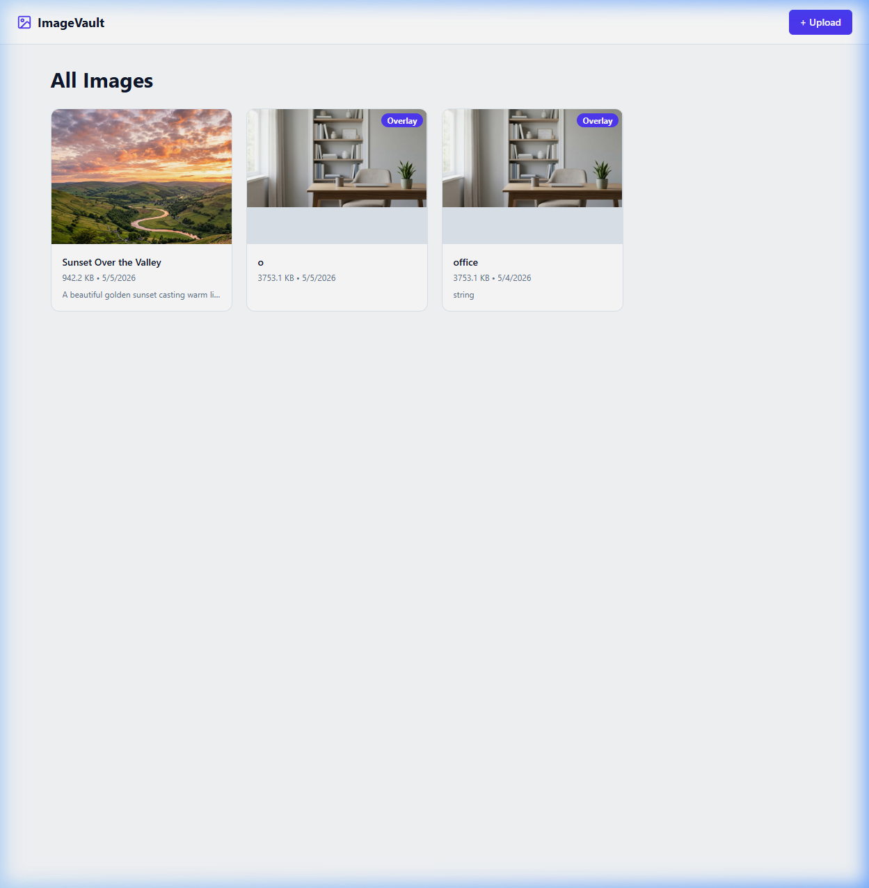
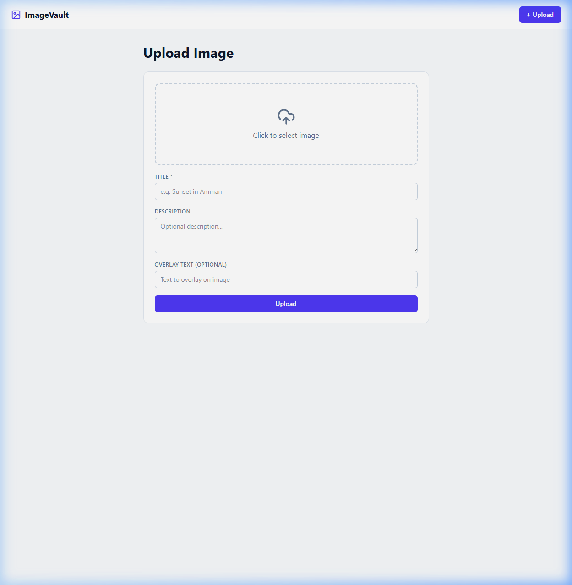
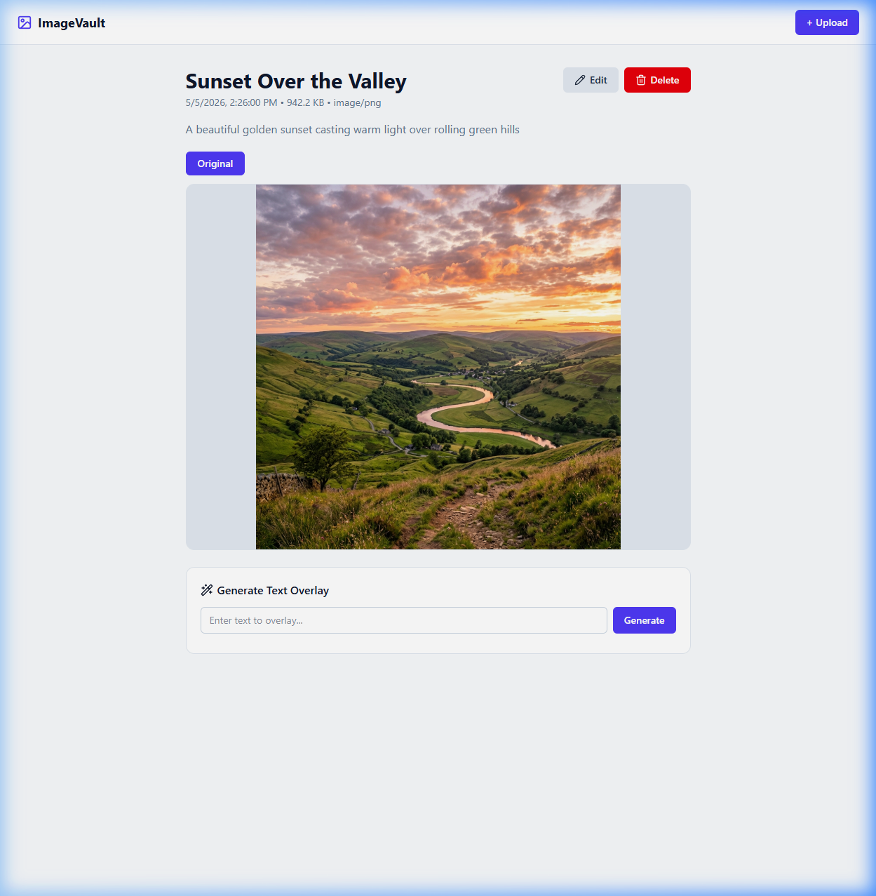
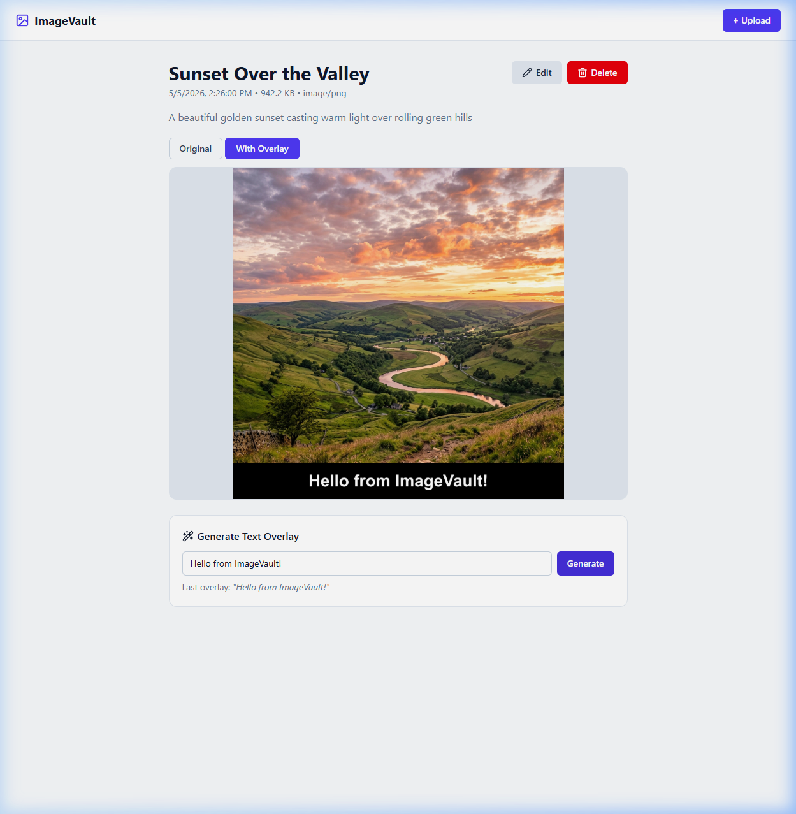
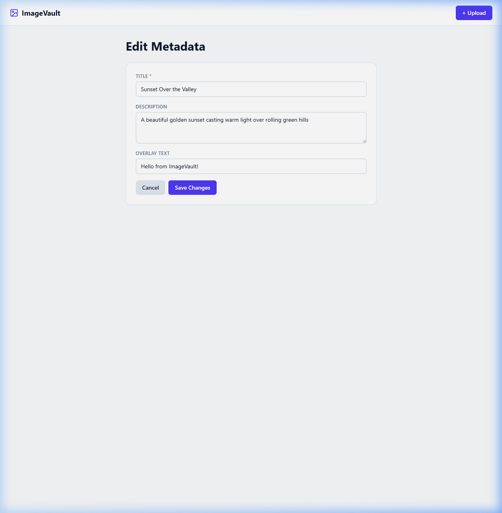

# ImageVault

A full-stack web application for image CRUD with a computer-vision text-overlay feature.

---

## Screenshots

### Gallery View
Browse all uploaded images in a responsive card grid. Cards show a thumbnail, title, file size, date, and an **Overlay** badge when a text overlay has been generated.



### Upload Image
Upload images via a drag-and-drop style form. Provide a title, optional description, and optional overlay text at upload time.



### Image Detail
View full-size images with metadata (date, size, MIME type). Use the **Edit** and **Delete** actions, or generate a text overlay directly from this page.



### Text Overlay Result
After generating an overlay, switch between the **Original** and **With Overlay** tabs. The overlay renders white text on a semi-transparent dark bar at the bottom of the image.



### Edit Metadata
Update the image title, description, and overlay text from a dedicated edit form.



---

## Tech Stack

| Layer | Technology | Why |
|---|---|---|
| Backend | ASP.NET Core 9 Web API | Requested by task, excellent file-handling support |
| Frontend | React 19 + Vite | Fast dev server, component model suits the UI |
| Database | SQLite + EF Core 9 | Zero-config, perfect for local/demo setups |
| Image Processing | SixLabors.ImageSharp + ImageSharp.Drawing | Pure .NET, no native deps, great font rendering |

---

## Architecture

```
┌─────────────────────────────────────────────────────────┐
│                     Browser (React)                      │
│  ImageList ─ ImageDetail ─ ImageUpload ─ ImageEdit       │
└──────────────────────┬──────────────────────────────────┘
                       │ HTTP (axios)
                       ▼
┌─────────────────────────────────────────────────────────┐
│              ASP.NET Core 9 Web API (:5000)              │
│                                                          │
│  ImagesController                                        │
│   GET  /api/images          → list all                   │
│   GET  /api/images/{id}     → get one                    │
│   POST /api/images          → upload + save metadata     │
│   PUT  /api/images/{id}     → edit metadata              │
│   DELETE /api/images/{id}   → delete image + files       │
│   POST /api/images/{id}/overlay → generate text overlay  │
│                                                          │
│  ImageService (SixLabors.ImageSharp)                     │
│   • Validates MIME type & 10 MB size limit               │
│   • Saves file with a UUID filename                      │
│   • Renders text onto a copy of the image                │
│                                                          │
│  AppDbContext (EF Core + SQLite)                         │
│   Table: Images (id, title, description, fileName,       │
│          contentType, fileSize, overlayText,             │
│          overlayFileName, createdAt, updatedAt)          │
│                                                          │
│  Static files served from wwwroot/uploads/               │
└──────────────────────────────────────────────────────────┘
```

---

## Folder Structure

```
imager/
├── docs/screenshots/             # README demo images
├── ImageVault.API/               # ASP.NET Core backend
│   ├── Controllers/
│   │   └── ImagesController.cs   # REST endpoints
│   ├── Data/
│   │   └── AppDbContext.cs       # EF Core context
│   ├── Models/
│   │   ├── ImageItem.cs          # Entity
│   │   └── Dtos.cs               # Request/response records
│   ├── Services/
│   │   ├── IImageService.cs
│   │   └── ImageService.cs       # File save + overlay generation
│   ├── wwwroot/uploads/          # Served image files
│   ├── Program.cs
│   └── appsettings.json
│
└── frontend/                     # React + Vite
    └── src/
        ├── components/
        │   └── Navbar.jsx
        ├── pages/
        │   ├── ImageList.jsx     # Gallery view
        │   ├── ImageUpload.jsx   # Upload form
        │   ├── ImageDetail.jsx   # View + overlay tool
        │   └── ImageEdit.jsx     # Edit metadata
        ├── services/
        │   └── api.js            # Axios API calls
        ├── App.jsx               # Router
        └── App.css               # All styles
```

---

## Prerequisites

- [.NET 9 SDK](https://dotnet.microsoft.com/download)
- [Node.js 18+](https://nodejs.org/)

---

## Setup & Run

### 1 — Backend

```bash
cd ImageVault.API
dotnet run
```

The API starts at **http://localhost:5000**.  
The SQLite database (`imagevault.db`) is created automatically on first run.  
Swagger UI is available at **http://localhost:5000/swagger**.

### 2 — Frontend

```bash
cd frontend
npm install
npm run dev
```

The app opens at **http://localhost:5173**.

---

## API Endpoints

| Method | Route | Description |
|--------|-------|-------------|
| GET | `/api/images` | List all images |
| GET | `/api/images/{id}` | Get image details |
| POST | `/api/images` | Upload image (multipart/form-data) |
| PUT | `/api/images/{id}` | Update title / description / overlay text |
| DELETE | `/api/images/{id}` | Delete image and its files |
| POST | `/api/images/{id}/overlay` | Generate text overlay image |

Upload form fields: `file`, `title`, `description`, `overlayText` (optional).  
Overlay body: `{ "text": "your text here" }`.

---

## Text Overlay — How It Works

1. User enters text on the Image Detail page and clicks **Generate**.
2. The API loads the original image with `SixLabors.ImageSharp`.
3. A semi-transparent dark bar is painted across the bottom of the image.
4. The text is rendered in white using a system font (`Segoe UI` on Windows).
5. The result is saved as a new file (`overlay_<uuid>.<ext>`).
6. The frontend switches to the **With Overlay** tab automatically.

---

## Security Notes

- Only `image/jpeg`, `image/png`, `image/gif`, and `image/webp` are accepted.
- Files are stored under a UUID filename — the original filename is never used on disk.
- Upload size is limited to **10 MB**.
- CORS is locked to `http://localhost:5173` in development.

---

## Development Approach

The implementation is intentionally straightforward — no microservices, no auth, no cloud storage. The goal was to demonstrate:

- Clean separation between Controller → Service → Database layers
- Correct multipart file upload handling
- Real image processing (not a placeholder) using ImageSharp
- A minimal but polished React UI with proper loading/error states
- SQLite for zero-config persistence suitable for evaluation

The overlay is non-destructive: the original image is never modified. Each overlay call overwrites only the previous overlay file.
